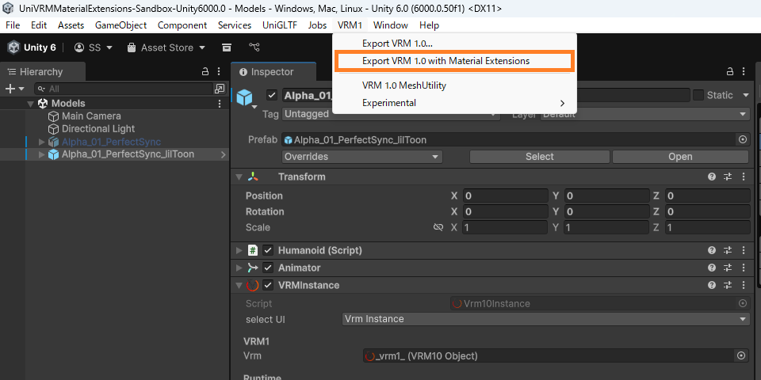
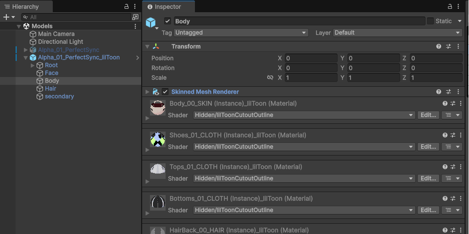
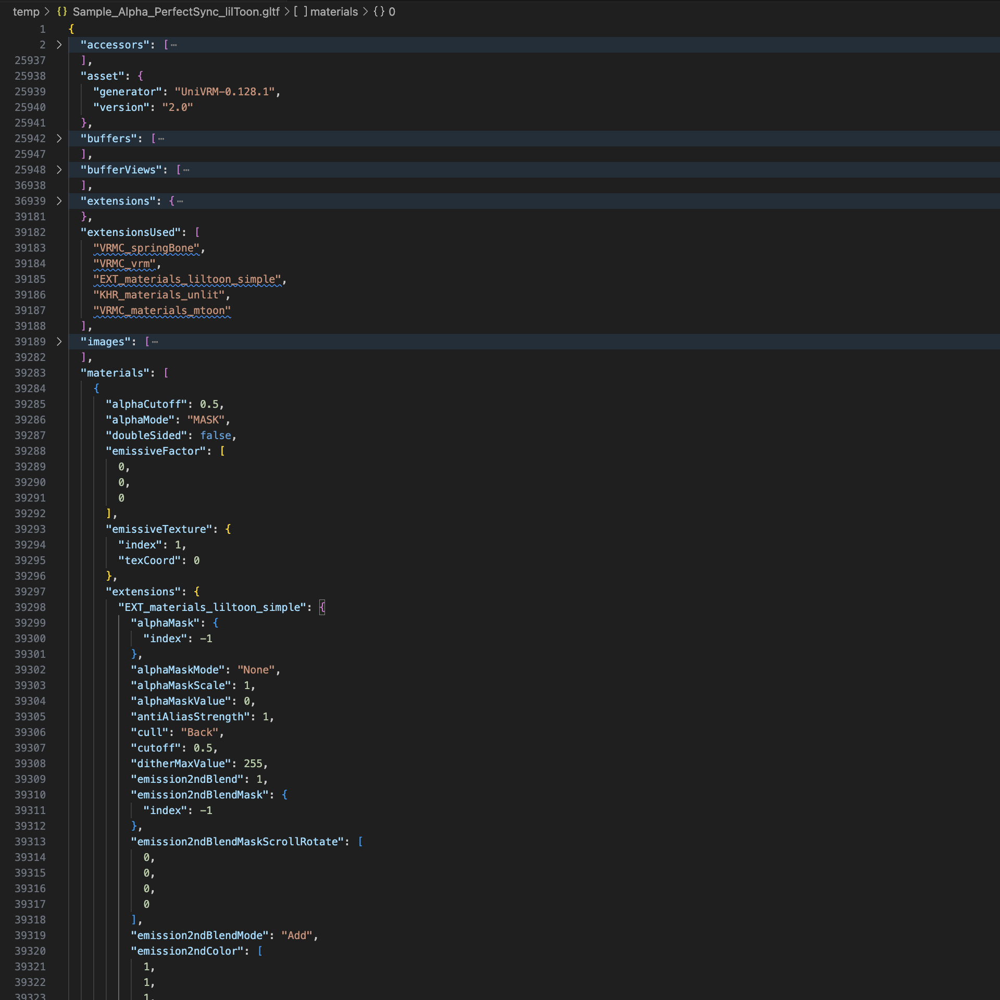
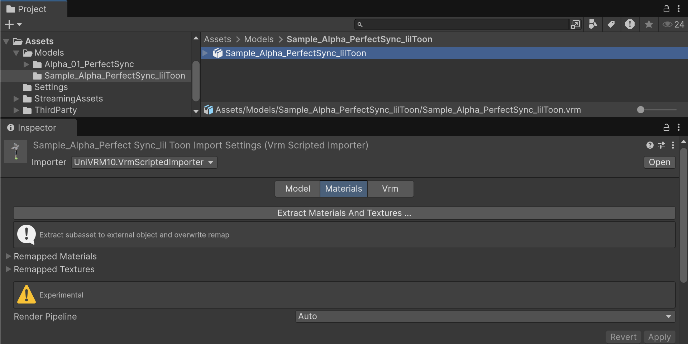
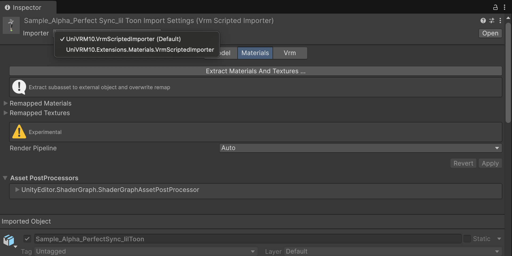
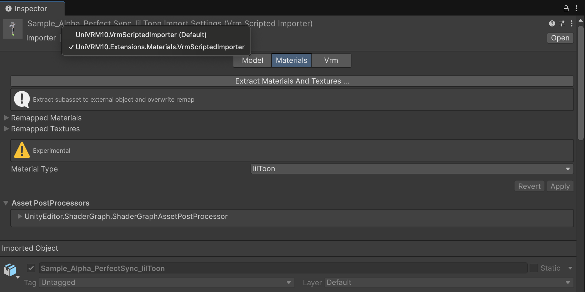
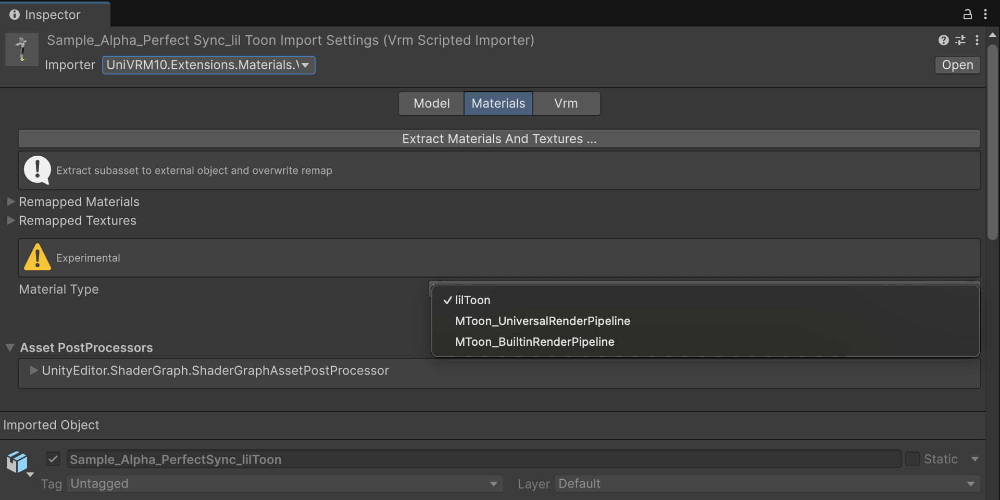
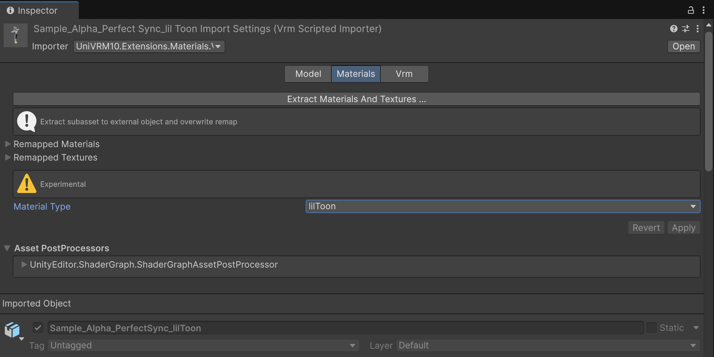
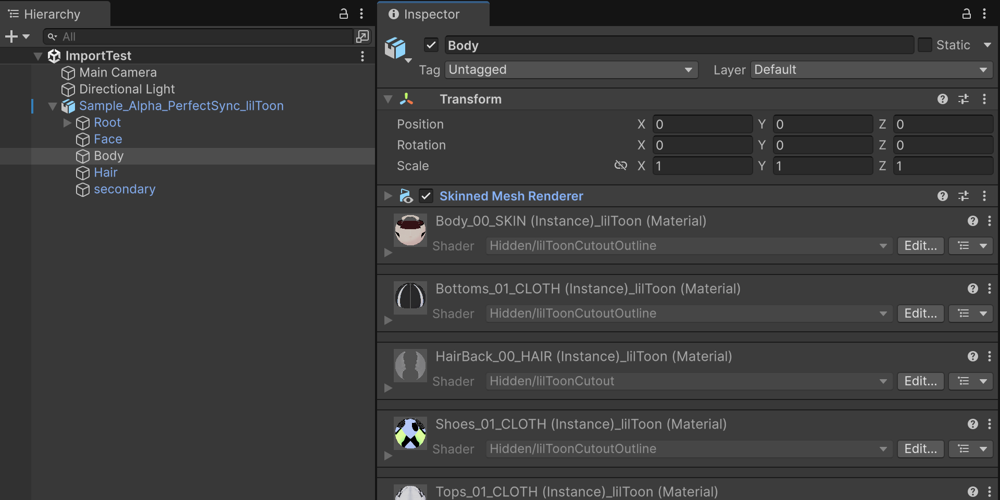

# UniVRM Material Extensions

[English](./README_en.md)

VRMファイルのマテリアル拡張を提供するUnityライブラリです。VRM標準には含まれないマテリアル定義を追加したVRMファイルの作成・読み込みを可能にします。

VRM標準ではサポートされていないシェーダーを使用している3DキャラクターモデルをVRM対応アプリケーションで取り扱うことができます。  

## 機能
### エクスポーター
追加のマテリアル定義を含むVRMファイルを出力することができます。

エクスポーターで出力したVRMモデルをこのライブラリが導入されていないアプリケーションで読み込む場合、  
他のツールで作成されたVRMモデルと同様に、VRM標準のマテリアル定義を用いてモデルを読み込むことができます。

モデルデータのポータビリティが失われることはありません。

### インポーター
追加のマテリアル定義を含むVRMファイルを読み込むことができます。  

### 利用可能なマテリアル一覧
| マテリアル / シェーダー | 備考 |
|---|---|
| [lilToon](https://github.com/lilxyzw/lilToon) | v1.8.5で動作確認済み。「簡易設定」のパラメーターのみサポート。 |
| MToon (URP) | UniVRM標準機能 |
| MToon (Built-in) | UniVRM標準機能 |
| Standard / URP Lit | glTF標準機能 |

将来的に他のマテリアル（シェーダー）のサポートを追加できるアーキテクチャになっています。

## 採用事例
- [Kinemagic Studio](https://youtu.be/sKyuwVir27k)

## 動作環境
- Unity 2022.3以降
- 依存関係
  - [UniVRM v0.128.1以降](https://github.com/vrm-c/UniVRM)
  - [lilToon 1.8.5](https://github.com/lilxyzw/lilToon)

## インストール方法
### 依存関係のインストール
[UniVRM](https://github.com/vrm-c/UniVRM)と[lilToon](https://github.com/lilxyzw/lilToon)をプロジェクトにインストールしてください。

### UniVRM Material Extensionsのインストール
UnityエディターのPackage Managerからインストールできます。

1. Package Managerウィンドウを開く
2. `+` ボタンをクリックして「Add package from git URL」を選択する
3. 次のURLを入力: `https://github.com/sotanmochi/UniVRMMaterialExtensions.git?path=src/UniVRMMaterialExtensions/Assets/VRM10.Extensions.Materials#0.4.0`

Packages/manifest.jsonを直接編集してインストールすることも可能です。
```
// Packages/manifest.json
{
  "dependencies": {
    ...
    "jp.sotanmochi.vrm.extensions.materials": "https://github.com/sotanmochi/UniVRMMaterialExtensions.git?path=src/UniVRMMaterialExtensions/Assets/VRM10.Extensions.Materials#0.4.0",
    ...
  }
}
```

## 使い方

### VRMファイルのエクスポート
1. VRMモデルをシーンに配置して選択する
2. メニューから [VRM] → [Export VRM with Material Extensions] をクリックする
3. カスタムマテリアルの情報を含むVRMファイルがエクスポートされます



例えば、[lilToon](https://github.com/lilxyzw/lilToon)を使っているモデルをエクスポートした場合、VRMファイルに`EXT_materials_liltoon_simple`の情報が格納される。





### VRMファイルのインポート（Unity Editor）
1. VRMファイルをプロジェクトにドラッグ&ドロップする
2. VRMファイルを選択してInspectorでImporterを`UniVRM10.Extensions.Materials.VrmScriptedImporter`に変更する
3. `Material Type`を`lilToon`に設定する
4. `Apply`ボタンをクリックしてインポート設定を適用する













### VRMファイルのインポート（スクリプト）

```cs
using System.IO;
using UnityEngine;
using UniVRM10;
using UniVRM10.Extensions.Materials.lilToon;

namespace Sandbox
{
    public sealed class ImportSample : MonoBehaviour
    {
        [SerializeField] string _streamingAssetsPath = "VRM/Sample_Alpha_PerfectSync_lilToon.vrm";

        async void Start()
        {
            var filePath = Path.Combine(Application.streamingAssetsPath, _streamingAssetsPath);
            var materialGenerator = new lilToonMaterialDescriptorGenerator();

            await Vrm10.LoadPathAsync(
                path: filePath,
                canLoadVrm0X: true,
                showMeshes: true,
                materialGenerator: materialGenerator,
                ct: default);
        }
    }
}
```

## ライセンス情報
- [MITライセンス](LICENSE.txt)
- [サードパーティ通知](THIRD-PARTY-NOTICES.txt)
