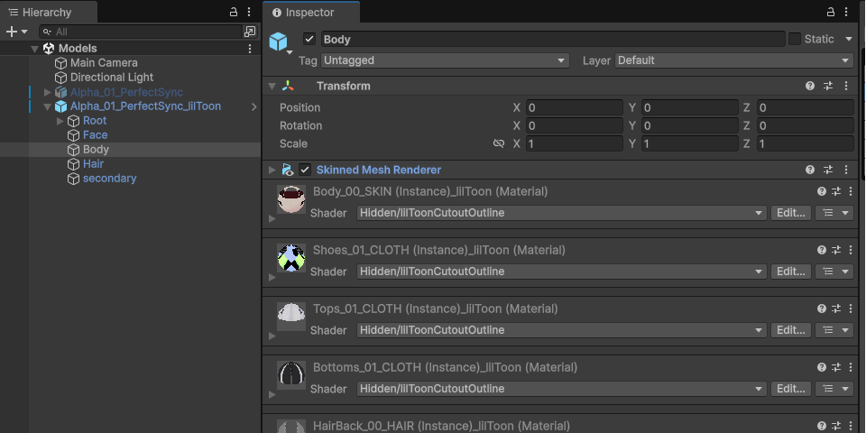
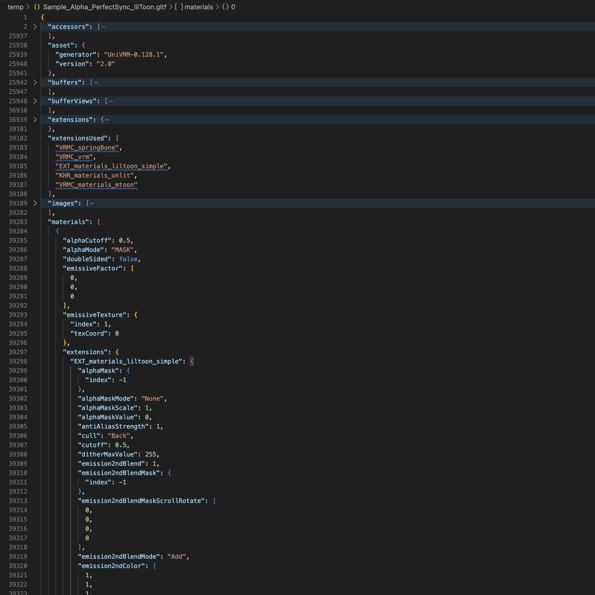
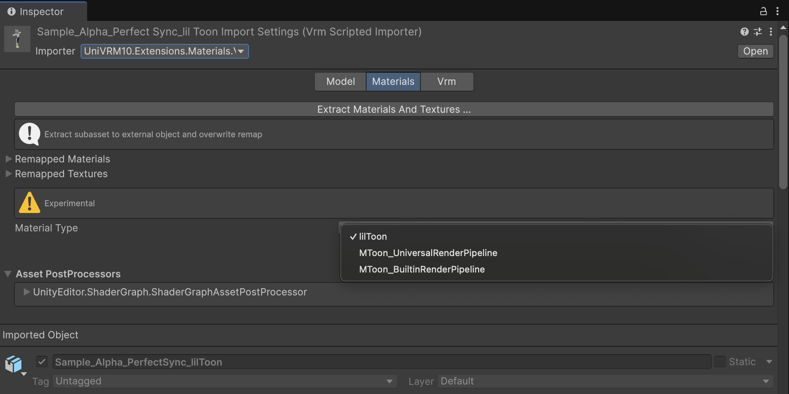
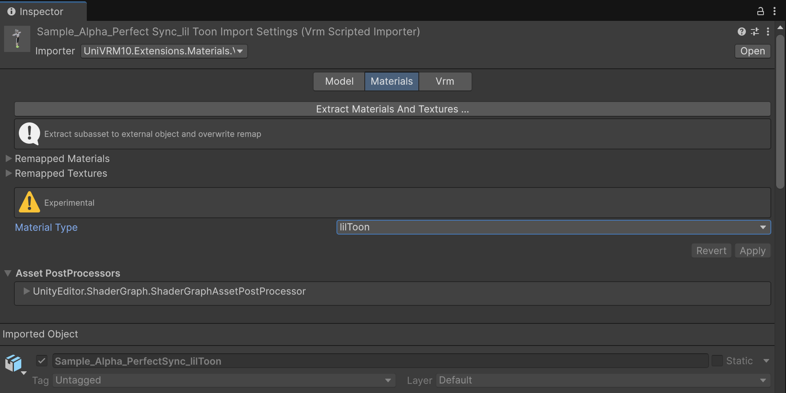
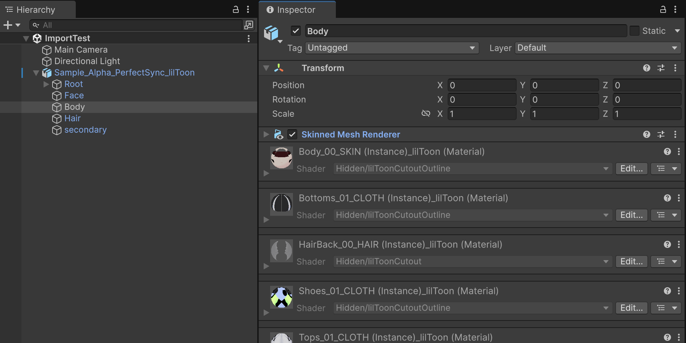

# UniVRM Material Extensions

[日本語](./README.md)

This is a Unity library that provides material extensions for VRM files.
It enables creating and importing VRM files with material definitions that are not included in the VRM standard.

You can handle 3D character models using shaders not supported by the VRM standard in VRM-compatible applications.

## Features
### Available Materials
| Material / Shader | Notes |
|---|---|
| [lilToon](https://github.com/lilxyzw/lilToon) | Tested with v1.8.5. Only "Simple Settings" parameters are supported. |
| MToon (URP) | UniVRM standard feature |
| MToon (Built-in) | UniVRM standard feature |
| Standard / URP Lit | glTF standard feature |

The architecture is designed to allow for adding support for other materials (shaders) in the future.

### Exporter
You can export VRM files containing additional material definitions.

When VRM models exported with this exporter are imported into applications without this library,  
the models can be imported using VRM standard material definitions, just like VRM models created with other tools.  

Model data portability is not lost.

### Importer
You can import VRM files containing additional material definitions.

## Use Cases
- [Kinemagic Studio](https://kinemagicstudio.github.io/)

## Requirements
- Unity 2022.3 or later
- Dependencies
  - [UniVRM v0.128.1 or later](https://github.com/vrm-c/UniVRM)
  - [lilToon 1.8.5](https://github.com/lilxyzw/lilToon)

## Installation
### Installing Dependencies
Please install [UniVRM](https://github.com/vrm-c/UniVRM) and [lilToon](https://github.com/lilxyzw/lilToon) in your project.

### Installing UniVRM Material Extensions
You can install via Package Manager in Unity Editor.

1. Open the Package Manager window
2. Click the `+` button and select "Add package from git URL"
3. Enter the following URL: `https://github.com/sotanmochi/UniVRMMaterialExtensions.git?path=src/UniVRMMaterialExtensions/Assets/VRM10.Extensions.Materials#0.4.0`

You can also install via editing Packages/manifest.json directly.
```
// Packages/manifest.json
{
  "dependencies": {
    ...
    "jp.sotanmochi.vrm.extensions.materials": "https://github.com/sotanmochi/UniVRMMaterialExtensions.git?path=src/UniVRMMaterialExtensions/Assets/VRM10.Extensions.Materials#0.4.0",
    ...
  }
}
```

## Usage

### Exporting VRM Files
1. Place and select a VRM model in the scene
2. Click [VRM] → [Export VRM with Material Extensions] from the menu
3. A VRM file containing custom material information will be exported


For example, when exporting a model using [lilToon](https://github.com/lilxyzw/lilToon), the VRM file will contain `EXT_materials_liltoon_simple` information.





### Importing VRM Files (Unity Editor)
1. Drag and drop the VRM file into your project
2. Select the VRM file and change the Importer to `UniVRM10.Extensions.Materials.VrmScriptedImporter` in the Inspector
3. Set `Material Type` to `lilToon`
4. Click the `Apply` button to apply the import settings








### Importing VRM Files (Script)

```cs
using System.IO;
using UnityEngine;
using UniVRM10;
using UniVRM10.Extensions.Materials.lilToon;

namespace Sandbox
{
    public sealed class ImportSample : MonoBehaviour
    {
        [SerializeField] string _streamingAssetsPath = "VRM/Sample_Alpha_PerfectSync_lilToon.vrm";

        async void Start()
        {
            var filePath = Path.Combine(Application.streamingAssetsPath, _streamingAssetsPath);
            var materialGenerator = new lilToonMaterialDescriptorGenerator();

            await Vrm10.LoadPathAsync(
                path: filePath,
                canLoadVrm0X: true,
                showMeshes: true,
                materialGenerator: materialGenerator,
                ct: default);
        }
    }
}
```

## License Information
- [MIT License](LICENSE.txt)
- [Third Party Notices](THIRD-PARTY-NOTICES.txt)
